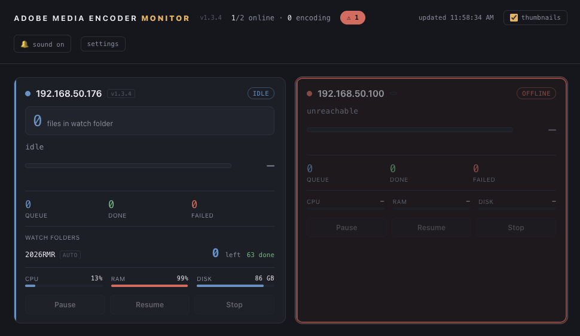
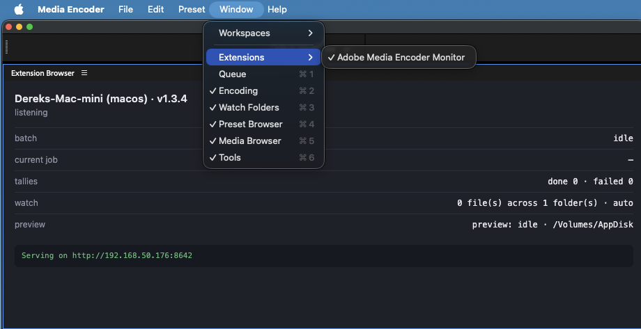
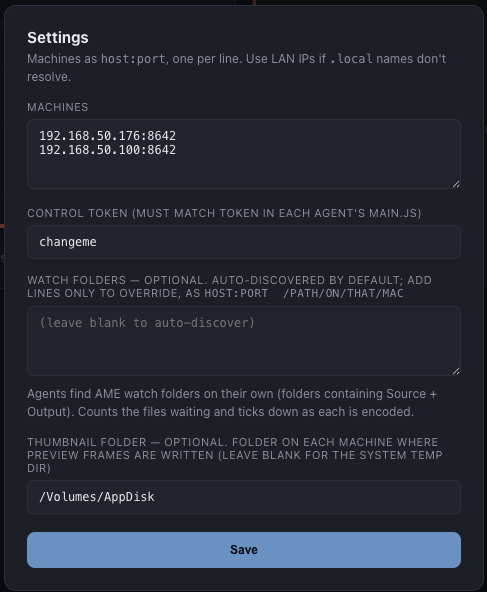

# AME Monitor — single pane of glass for Adobe Media Encoder

**AME Monitor is designed for teams running large media-encoding jobs across multiple
machines.** If you have three or four (or more) computers churning through Adobe Media
Encoder queues, this plugin gives you a **single web interface** to watch all of them at
once — one pane of glass showing every machine's job status, progress, watch-folder
counts, and health, instead of walking between workstations or screen-sharing into each one.

Live encode status, file paths, a frame thumbnail, watch-folder counts, and machine
health across several machines running Adobe Media Encoder — from one web page, with
pause / resume / stop control.



## How it works

AME has **no official web/REST API**; its only programmatic surface is the ExtendScript
scripting API, which runs *inside* AME. Each Mac runs a tiny **CEP panel** (the agent) that
hooks AME's encode events, captures a frame, adds machine + watch-folder info from Node.js,
and serves it over HTTP. A single **dashboard** page polls every agent.

```
 Mac 1 ─ AME + agent ─┐  status / thumb  →
 Mac 2 ─ AME + agent ─┼────────────────────  dashboard.html  (you, in a browser)
 Mac 3 ─ AME + agent ─┘  ← pause/resume/stop, watch-folder config
```

## What each card shows



- **Frame thumbnail** of the current job (AME renders a TIFF; the agent converts it to JPEG with `sips`).
- **Current job** name with **source/output paths** (for watch-folder jobs the name and source path come from the filesystem — see below).
- **Live progress** + render bar (blue audio pass, amber video pass), elapsed + ETA.
- **Watch folders** — for each folder on that Mac: how many files are **left** (counts down as each encodes) and how many are **done**.
- **Queue / done / failed** tallies and **machine health** (CPU, RAM, free disk).
- **Controls** — Pause / Resume / Stop; **flashing alert** on offline or new failure with a ⚠ count and optional beep.



## A note on file names

Some AME versions send encode events with **no file path in them at all** (only progress and
status — confirmed via `/debug`). For **watch-folder** jobs the agent works around this by
reading the filesystem: the file currently in the watch-folder root is the one encoding (its
name and source path are shown), and files AME moves into `Source/` are listed as recently
completed. Manually-queued jobs on those versions may show a generic name.

## Watch folders — auto-discovered

You don't enter anything. Each agent finds AME's watch folders on its own by:
1. reading AME's prefs directory (`~/Documents/Adobe/Adobe Media Encoder/<ver>/`) for candidate paths, and
2. scanning your home folder and every mounted volume for AME's watch-folder signature — a
   directory containing **both** a `Source` and an `Output` subfolder (AME creates these on the
   first encode).

Found folders appear on the card tagged **auto**, with a count of files **waiting** that ticks
down as each one encodes and moves into `Source/`. Re-scan happens every ~20s.

If auto-discovery misses something (e.g. a brand-new folder AME hasn't encoded into yet, so it
has no `Source`/`Output`), you can still add it manually in dashboard **settings** as
`host:port  /path` — manual entries are merged with the auto-discovered ones.

## Install the agent (each machine)

**macOS:**
```bash
cd ame-monitor/install
./install-agent.sh
```

**Windows:** double-click `install\install-agent.bat` (no admin needed).

Either way: quit and reopen AME, open **Window ▸ Extensions ▸ AME Monitor** once, confirm it
prints `Serving on http://<ip>:8642`, and allow the firewall prompt. The same panel runs on both
platforms; the installer just copies it to the right CEP folder and enables unsigned extensions
(via `defaults` on macOS, the `HKCU\...\CSXS` registry keys on Windows). The only things you
might change in `agent/js/main.js` are `TOKEN` (control secret) and `DISK_PATH` (default `/` on
macOS, `C:` on Windows). Watch folders are auto-discovered.

## Dashboard

macOS:
```bash
cd ame-monitor/install
./serve-dashboard.sh        # prints e.g. http://mac-render-1.local:9000/dashboard.html
```
Windows: double-click `install\serve-dashboard.bat`.

Open the printed URL, click **settings**, enter your machines (`host:8642`) and the token.
Watch folders are auto-discovered, so you normally don't enter them. Settings persist in the browser.

## `/debug` — for tuning

`http://<mac>:8642/debug` returns the raw last events (`lastEvent` / `lastStarted` /
`lastComplete`, with unknown properties in `[brackets]`), the thumbnail status, and the watch
config the agent currently holds. Handy if a thumbnail or name isn't appearing.

## Endpoints (per agent)

- `GET /status` — machine, health, watch folders, job state (JSON)
- `GET /thumb` — current frame as JPEG (404 when idle)
- `GET /debug` — raw events + thumb status + watch config
- `GET /config?watch=<paths>` — set this agent's watch folders (no token needed)
- `GET /control?action=pause|resume|stop&token=…` — drive the encoder

## Security

Status/thumb are unauthenticated; control and config need the token. Keep everything on a
trusted LAN; never expose `:8642` to the internet.

## Limitations

- **Queue/“current” detail** comes from events that lack paths on some versions; watch-folder
  filenames are recovered from disk instead.
- When several files sit in the watch root at once, "currently encoding" is a best guess
  (oldest first); the **left** count and the **recently completed** list stay accurate regardless.
- **Watch %/countdown** assumes AME's default move-to-`Source` behavior.
- **Thumbnail** needs `getCurrentBatchPreview` (most AME versions); converted to JPEG with `sips` on macOS or PowerShell/System.Drawing on Windows (both built in).
- **AME must be open** to report or accept commands.

## Troubleshooting

- **No watch count** → set the folder in dashboard settings; check the path exists on that Mac
  (the card says "folder not found" if not); confirm the token matches.
- **No thumbnail** → check `/debug` `thumbStatus`: `err:…`/`unsupported` means your AME build
  doesn't support the preview call; `sips-failed` means conversion failed. Rest still works.
- **No file path / generic name** → expected on versions whose events omit paths; use a watch
  folder to recover names, or check `/debug` `lastStarted`/`lastComplete` for a path field.
- **Card stuck offline** → confirm the panel is serving; `curl` it; check host/port and firewall.
- **Command rejected: bad token** → match the dashboard token to each agent's `TOKEN`.
- **`EADDRINUSE`** → change `PORT` in `main.js` and the dashboard host entries.

## License

MIT — see [LICENSE](../LICENSE). Free to use, modify, and distribute.
